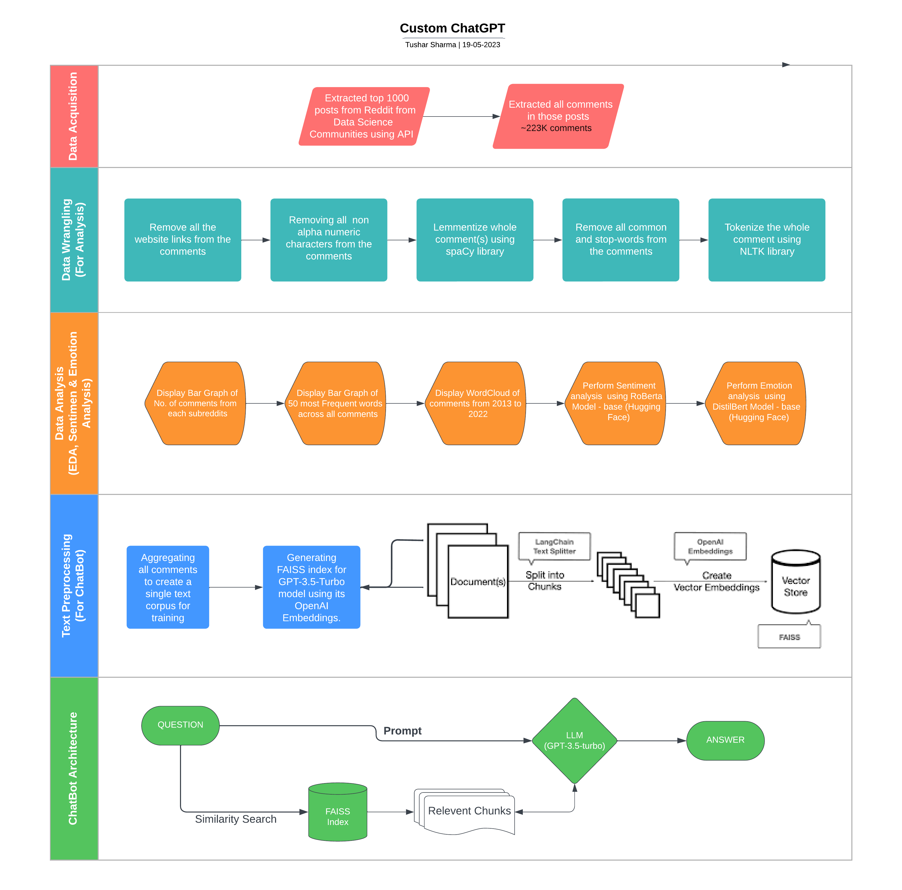
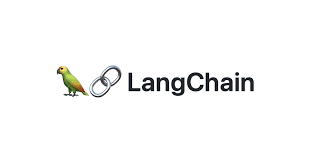

# 
__Custom ChatGPT__

    

## Introduction

By combining the wealth of knowledge shared within the Reddit data science community, the power of OpenAI's GPT-3.5-Turbo model, the efficiency of the [Langchain](https://python.langchain.com/) framework, and the retrieval capabilities of the [FAISS](https://ai.facebook.com/tools/faiss/#:~:text=FAISS%20contains%20algorithms%20that%20search,and%20GPU%20support%20via%20CUDA.) library, we create a bespoke ChatGPT that possesses the collective wisdom and expertise of the Reddit community. Our custom ChatGPT is poised to engage in intelligent, informative, and contextually relevant conversations on topics spanning data science, machine learning, artificial intelligence, and more. This project serves as a testament to the extraordinary potential of combining state-of-the-art language models with community-generated knowledge to push the boundaries of conversational AI.
#### Demo Video -

* Collected comments from the top 1000 posts of the three leading data science communities on Reddit using the official Reddit API to access and retrieve the desired comments. The sub-reddits used to extract the data are as follows -
   *  Machine Learning - [r/MachineLearning](https://www.reddit.com/r/MachineLearning/)
   *  Artificial Intelligence - [r/artificial](https://www.reddit.com/r/Artificial/)
   *  Data Science - [r/DataScience](https://www.reddit.com/r/DataScience/)

* The collected comments were compiled to create a text corpus. This corpus consisted of approximately 12 million words, derived from around 223k comments. The large corpus provided a substantial dataset for analysis.

* Exploratory data analysis techniques were employed to gain insights and understand the characteristics of the collected data. [NLTK](https://www.nltk.org/) and [spAcy](https://spacy.io/) were used for various analyses, enabling the identification of patterns and trends within the data.

* Pre-trained Hugging Face models were leveraged to perform sentiment and emotion analysis on the collected comments during the exploratory data analysis phase. These models are designed to accurately classify sentiment and emotions expressed in text data, providing valuable insights into the overall sentiment and emotional tone of the comments. The models used for sentiment and emotion analysis are as follows -
   * roBERTa-base UPDATED (2022) - [cardiffnlp/twitter-roberta-base-sentiment-latest](https://huggingface.co/cardiffnlp/twitter-roberta-base-sentiment-latest)
   * Distilbert-base-uncased-emotion - [bhadresh-savani/distilbert-base-uncased-emotion](https://huggingface.co/bhadresh-savani/distilbert-base-uncased-emotion) 

* Indexes of GPT-3.5-Turbo model embeddings were generated using the [Langchain](https://python.langchain.com/) and [FAISS](https://ai.facebook.com/tools/faiss/#:~:text=FAISS%20contains%20algorithms%20that%20search,and%20GPU%20support%20via%20CUDA.) framework. These indexes represented the contextual information captured by the GPT-3 model, enabling efficient retrieval of relevant embeddings based on user queries and prompts.

* A simulation web application was developed using [Streamlit](https://streamlit.io/). The web application provided a user-friendly interface for interacting with the chatbot, offering a seamless and intuitive chatbot experience.

## Getting started with the ChatBot

The ChatBot is not currently deployed due to the cost associated with accessing the GPT model through my personal OpenAI API key. However, you can still run the ChatBot on your local machine by following the instructions below. Make sure you have enough credits In your OpenAI account for using the ChatBot.

To run the ChatBot locally, please follow these detailed steps:

1. Clone the repository to your local machine by executing the following command in your terminal:
   
       git clone https://github.com/tushar-mahalya/Custom-ChatGPT.git
       cd Custom-ChatGPT
   
2. Create and activate a virtual environment (optional but recommended):
   - Using 'venv':
     
         python3 -m venv venv
         source venv/bin/activate
   - Using 'conda':
     
         conda create --name chatgpt-env
         conda activate chatgpt-env
  
4. Install the necessary dependencies by running the following command in your terminal:
   
       pip install -r requirements.txt
   
5. Configure your personal OpenAI API secret key by running the following command in your terminal:

       echo -e '[OpenAI]\nsecret_key = YOUR_PERSONAL_API_SECRET_KEY' > credentials.ini
   Replace YOUR_PERSONAL_API_SECRET_KEY with your actual OpenAI API secret key. This step ensures that the ChatBot can access the OpenAI GPT model using your credentials. Access your API key from [here](https://openai.com/blog/openai-api)
   
6. Start the application by running the following command in your terminal:

       streamlit run app.py
   This command will launch the ChatBot application and provide you with a local web address.
   
7. Open your web browser and enter the following URL in the address bar:
   
       http://localhost:8501/
   This will open the ChatBot interface in your web browser, allowing you to interact with the ChatBot locally.

Please note that running the ChatBot locally requires a suitable environment with Python and the necessary dependencies. Ensure that you meet the requirements and follow the instructions carefully to set up and run the ChatBot on your machine. Enjoy your conversation with the ChatBot!

## Pipelines & Workflows:

## Technical Methodologies

1. <b>LangChain Framework</b>: The LangChain framework is a language processing framework that provides a set of tools and libraries for building and deploying natural language processing (NLP) applications. It offers a comprehensive range of functionalities such as text preprocessing, tokenization, language modeling, semantic analysis, and text generation. The LangChain framework leverages state-of-the-art techniques from the field of NLP, including deep learning models like transformers, to enable efficient and accurate language processing tasks.

2. <b>FAISS Framework</b>: FAISS (Facebook AI Similarity Search) is a library developed by Facebook AI Research that provides efficient and scalable solutions for similarity search and clustering tasks. FAISS is primarily focused on solving large-scale search problems in high-dimensional spaces, making it well-suited for applications involving computer vision, natural language processing, and recommendation systems. The framework offers various indexing structures and algorithms, such as product quantization and IVF (Inverted File System), to accelerate nearest neighbor search operations.

3. <b>GPT 3.5 Turbo Model</b>: GPT 3.5 Turbo is an advanced language model developed by OpenAI. It is based on the GPT (Generative Pre-trained Transformer) architecture and represents a significant advancement in natural language processing. GPT 3.5 Turbo exhibits impressive language generation capabilities and can be fine-tuned for specific tasks. The model has been trained on a massive corpus of text data and has a deep understanding of language patterns, enabling it to generate coherent and contextually relevant responses.

## Potential Use Cases:

1. <b>Customer Support</b>: Custom ChatGPT can be deployed in customer support systems to provide instant assistance and answer frequently asked questions. By understanding customer queries and providing relevant responses, it can enhance the efficiency and effectiveness of customer support operations, reducing response time and improving customer satisfaction.

2. <b>Confidential Information Handling</b>: The Custom ChatGPT model can be trained on confidential company policies and internal knowledge without compromising privacy.It can provide answers and assistance based on the confidential information, ensuring that sensitive company data remains protected. This feature enables employees to access relevant information while maintaining the confidentiality and integrity of the company's proprietary knowledge.

3. <b>Personalized Virtual Assistants</b>: The Custom ChatGPT model can serve as a virtual assistant tailored to individual users' preferences and requirements. It can provide personalized recommendations, answer queries, and assist with various tasks such as scheduling, reminders, and information retrieval, creating a more engaging and interactive user experience.

4. <b>Unpopular or Niche Language Support</b>: Custom ChatGPT can be tailored to provide answers and support in uncommon or niche languages. By training the model on specific language data, it ensures accurate and relevant information for underrepresented language communities, promoting inclusivity and accessibility.

5. <b>Language Learning and Tutors</b>: Custom ChatGPT can be utilized in language learning applications as an intelligent language tutor. It can engage in conversations with learners, provide feedback on their language skills, and offer language learning resources and exercises tailored to individual proficiency levels and learning objectives.

6. <b>Decision Support Systems</b>: The Custom ChatGPT model can be integrated into decision support systems, assisting users in complex decision-making processes. By analyzing user inputs and providing relevant information and insights, it can help users make informed decisions across domains such as finance, healthcare, and business strategy.

## Challenges

* Creating FAISS indexes of the text corpus with OpenAI's gpt-3.5-turbo embeddings presents a major challenge due to the cost associated with using the OpenAI API key. Error-free and seamless processing is crucial, as any errors can result in the loss of created embeddings while still incurring charges. Proper text preprocessing using the right attributes of the langchain and faisa framework is necessary before initiating index creation.

* Dealing with delayed response is a significant issue at the start, primarily because the utilization of St.load_cache() for pre-loading large index files in the cache memory is not being employed. By pre-loading these files, the chatbot can avoid repeatedly loading them into memory whenever prompted with a question.

* Extracting limited domain knowledge is another challenge. Using all the comments from the aforementioned subreddits instead of just the top 1000 posts would result in a significantly larger text corpus, leading to extended index generation times, increased expenditure on embeddings, and the inclusion of unnecessary information that can affect performance. Extracting relevant chunks becomes a computationally demanding task.
  
* Uploading and managing large FAISS index files poses a challenge due to size limitations on platforms like GitHub. Since the FAISS index files are approximately 250MB in size, which exceeds the file size limit for regular GitHub repositories, special measures need to be taken. The files may need to be pushed to a Git Large File Storage (LFS) server or an alternative file hosting service to ensure successful deployment and access to these large files.

## Hardware Specification
For this project I've used [Amazon Sagemaker Studio Lab](https://studiolab.sagemaker.aws/) EC2-Instance which have the following specs - 
| Component | Specification |
| --- | --- |
| CPU | Intel® Xeon® Platinum 8259CL |
| Architecture | x86_64 |
| RAM | 16GB |
| Storage | 15GB (AWS S3 Bucket) |
| GPU | NVIDIA® Tesla T4 |
| CUDA Version | 11.4 |
| V-RAM | 15GB |

## Contributing

If you would like to contribute to the project, you can follow the steps below:

1. Fork the repository to your GitHub account.
2. Clone the repository to your local machine.
3. Create a new branch for your changes.
4. Make your changes to the codebase.
5. Push your changes to your forked repository.
6. Create a pull request from your forked repository to the original repository.

## License

This project is licensed under the [MIT License](https://opensource.org/license/mit/). You are free to use, modify and distribute the code as per the license terms
